# El Gran Torneo de la Arena

## Presentación General

**"El Gran Torneo de la Arena"** es un simulador de combates por turnos donde el jugador crea un equipo de héroes especializados, los entrena ganando experiencia, compra equipamiento mágico, y los enfrenta contra enemigos en emocionantes batallas. El sistema gestiona todo automáticamente: desde la distribución de objetos mágicos hasta el cálculo de daño, efectos especiales y progresión de personajes.

El proyecto simula todo lo que sucede en un RPG por turnos simple pero funcional: crear personajes con diferentes roles (Guerrero, Mago, Sanador, Paladín, Arquero), equiparlos con objetos mágicos que modifican sus atributos, y llevarlos a combatir contra enemigos en una arena. Durante cada combate, el sistema controla los turnos, calcula quién ataca a quién, aplica efectos temporales, y determina al ganador.

## Integrantes

- **Esteban Monroy**
- **Abraham Waggon**

## ¿Qué hace el programa?

1. **Creación de Héroes:** El jugador puede crear héroes con diferentes roles. Cada rol tiene fortalezas únicas:
   - **Guerrero:** Ataque poderoso y defensa equilibrada
   - **Mago:** Ataque mágico especial pero con menos vida
   - **Sanador:** Puede curar a sus aliados durante el combate
   - **Paladín:** Defensa alta y ataque equilibrado
   - **Arquero:** Ataque rápido con múltiples disparos

2. **Sistema de Gremio:** Los héroes pertenecen a un gremio que gestiona monedas y puntos. Cada victoria en combate otorga monedas para comprar mejoras.

3. **Inventario Mágico:** Existe una tienda con objetos mágicos que modifican los atributos de los personajes. Hay pociones de vida, cristales de poder, amuletos de furia, elixires, escudos benditos, runas protectoras, talismanes de velocidad y tomos de conocimiento.

4. **Combates por Turnos:** Los héroes se enfrentan contra enemigos en duelos por turnos. En cada turno:
   - Los héroes atacan primero
   - Los enemigos contraatacan
   - Se actualizan los efectos temporales 
   - Se verifica si alguien muere

5. **Sistema de Experiencia:** Cada victoria otorga experiencia. Cuando acumulan suficiente, los personajes suben de nivel y mejoran sus atributos.

6. **Menú Interactivo:** El programa tiene un menú fácil de usar donde puedes crear héroes, acceder a la tienda, iniciar combates y ver estadísticas de tus personajes.

## Diagrama de Clases UML

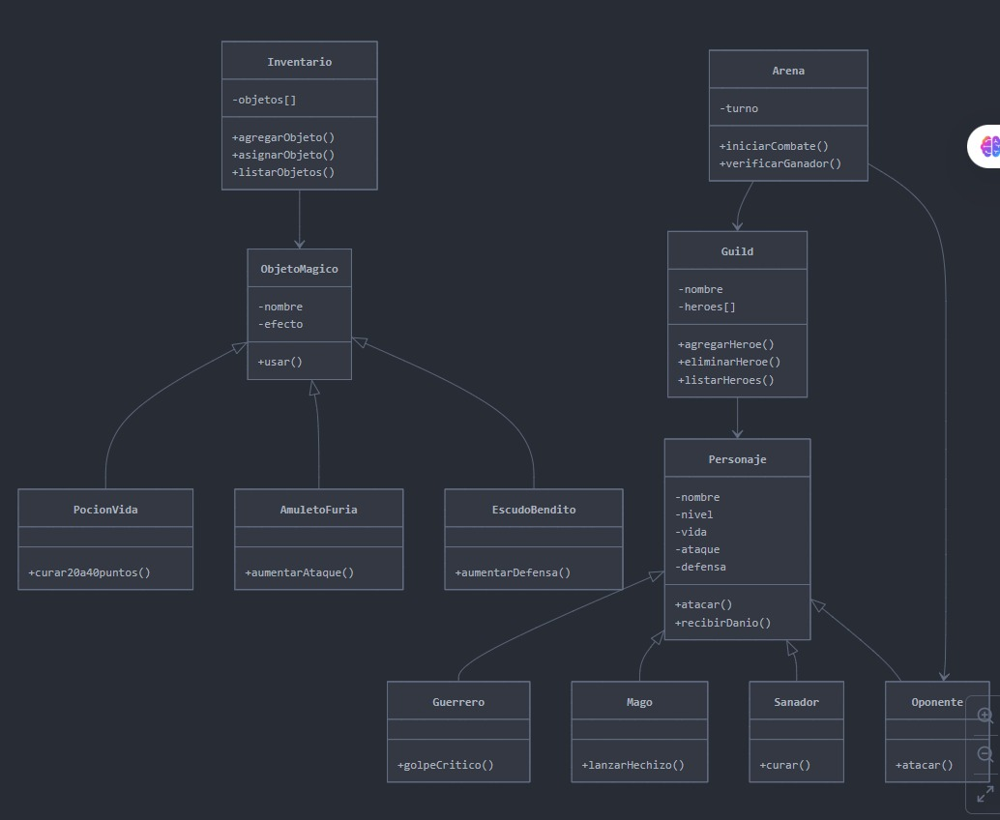
- **primer UML en donde se define de manera basica la idea puntual del desarrollo de nuestro proyecto**

## Imágenes del Proyecto Funcionando

A continuación se muestran capturas de pantalla del programa en ejecución:

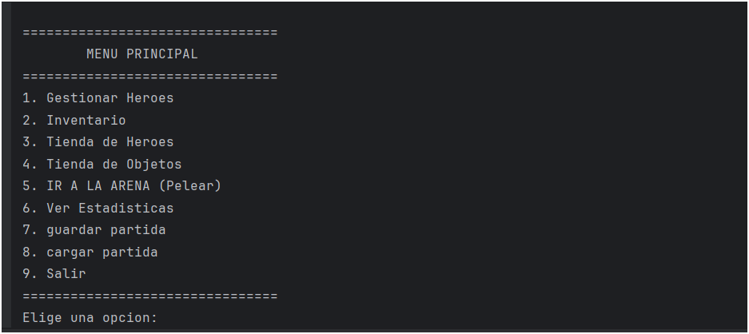
- **Menu principal del juego**
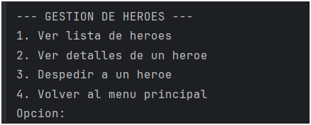
-  **Al seleccionar la opcion 1(Gestionar heroe) nos mustra diferentes funciones:**
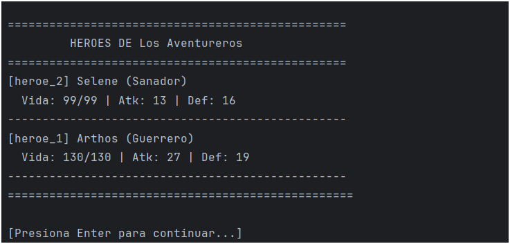
- **al seleccionar (ver lista de heroes) nos aparecen dos heroes predeterminados, aqui unacamente se puede ver los heroes ingresados**
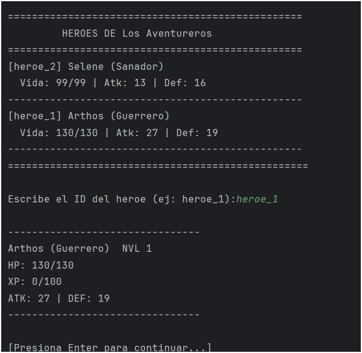
- **Aqui al selecccionar la opcion 2(ver detalles de un heroe) al poner el id del hero (ejemplo:heroe_1) podemos ver detaller del heroe como su nivel, hp(vida) experiencia y su ataque junto con defensa**
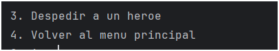
- **Las funciones (despedir un heroe) unicamente elimina al heroe de la lista de heroes y de la guild , ademas la opcion 4 unicamente funciona para salir al menu principal**

- **La opcion dos del menu principal (inventario) no permite mirar objetos, equiparlos y al igaul qeu en la anterior opcion volver al menu principal**
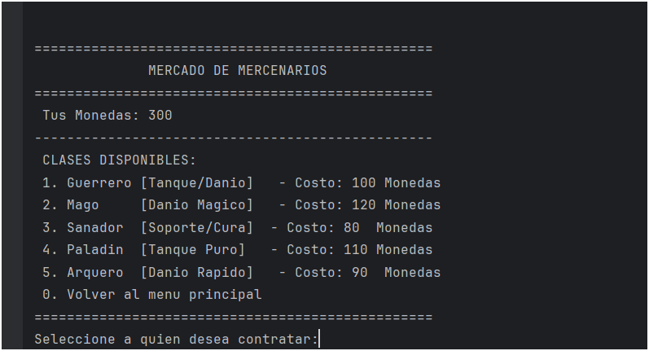
- **La opcion 3 (tienda de heroe) al implemnetar el sistema de monedas mediante un set se crea un espacio para comprar los heroes, en un inicio el usuario teiene 300 monedad queb le permiten comprar**
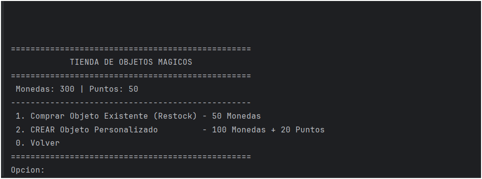
- **La opcion 4 tienda de onjetos nos permita al igual que antes comprar objetos o crearlos en donde la creacion de estos involucar el uso de puntos**
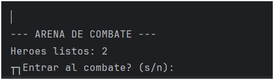
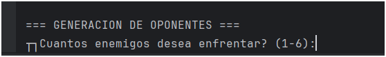
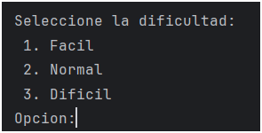
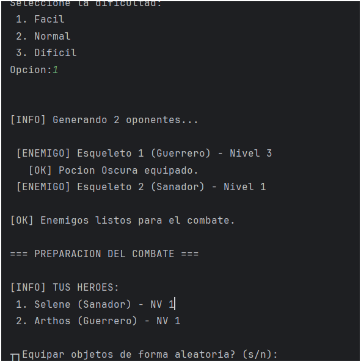
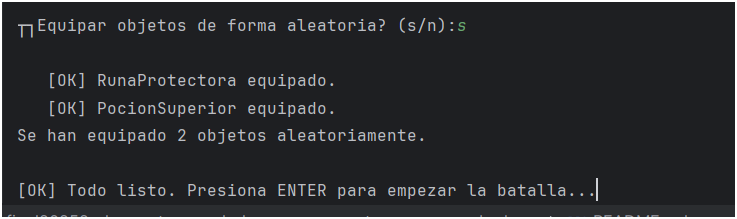
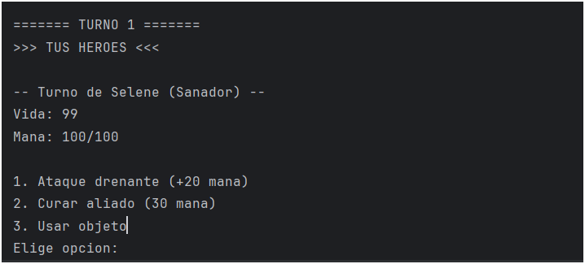
- **Al seleccionar la opcion 5 que es ir a la arena a pelear nos desengloza varios procesos, inialmente mnos muestra los heroes listos que serian lo que estan guardados, seguido de la generacion de los oponentes, en donde uno escoge la dificultad de ellos, lurgo nod murdtrs s ldo oponentes con sus caracteristicas seguido de lso heroes, despues nos da l posibilidad de escoger los obejtos amgicos ya sea aleatoriamente o sieno el usuario quien los selecciona y para quien, seguido del inicio de los turnos**
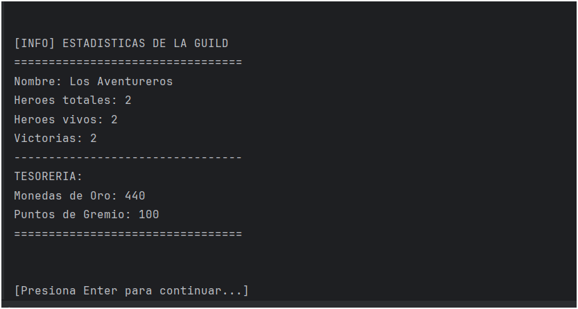
- **La opcion 6 la cual muestra las estadisticas las cuales se extraen edsde la guild donde muestra su avance y sus ganancias en puntos y en monedas**
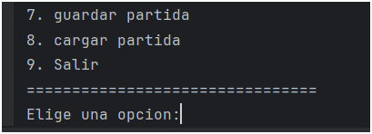
- **la opcion 7 funciona para guardar las partidas y la funcion 8 paara cargarlas dependiendo de lso procesos realizados, por ultimo al opcion 9 nos saca del juego con el fin de termianr todo el proceso**

## Cómo Funciona Técnicamente

El código está organizado en módulos claros:

- **Personaje.h/cpp:** Clase base abstracta que define qué es un personaje (vida, ataque, defensa, experiencia).
- **Subclases de Personaje:** Guerrero, Mago, Sanador, Paladín, Arquero, cada uno con su propio método `atacar()` especializado.
- **Guild.h/cpp:** Gestiona el equipo de héroes, monedas, puntos y la tienda donde comprar objetos.
- **Arena.h/cpp:** Controla los combates. Maneja los turnos, calcula daño, aplica efectos y determina ganadores.
- **Inventario.h/cpp:** Gestiona todos los objetos mágicos disponibles en el juego.
- **Objetos Mágicos:** Diferentes clases para cada tipo de objeto (PocionVida, CristalMagico, AmuletoFuria, etc.), todos heredan de ObjetoMagico.
- **main.cpp:** Menú principal del programa donde el jugador interactúa con el sistema.

### Conceptos de POO Utilizados

- **Herencia:** Los personajes heredan de una clase base Personaje. Los objetos mágicos heredan de ObjetoMagico.
- **Polimorfismo:** Cada personaje implementa su propio método `atacar()` de forma diferente. Cada objeto tiene su propio `aplicarEfecto()`.
- **Encapsulación:** Los atributos de cada clase son privados, se accede a través de métodos públicos.
- **Punteros:** Se usan punteros para manejar dinámicamente héroes, objetos y enemigos.
- **Estructuras de Datos STL:** Se usan `vector` para listas y `unordered_map` para búsquedas rápidas.

