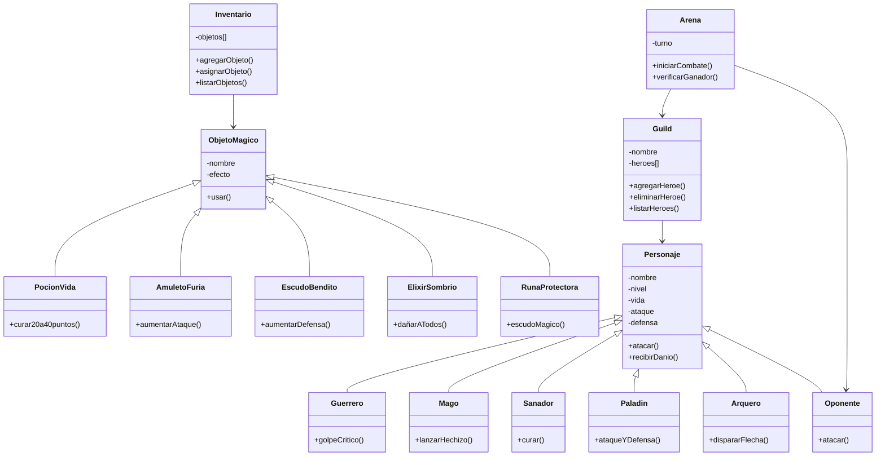
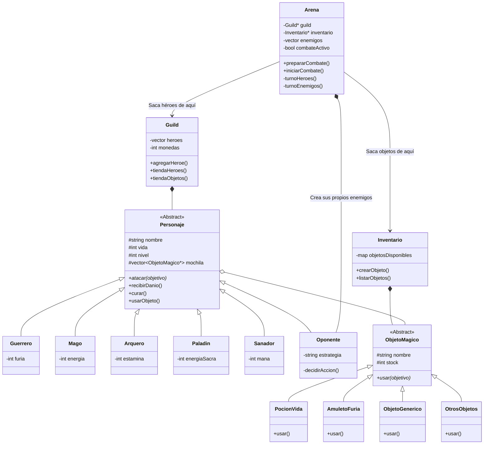

# El Gran Torneo de la Arena

## Presentación general

**El Gran Torneo de la Arena** es un simulador de combates por turnos donde el jugador crea un equipo de héroes especializados, los entrena ganando experiencia, compra equipamiento mágico y los enfrenta contra enemigos en batallas dentro de una arena.

El sistema gestiona automáticamente:

- La creación y administración de héroes.
- La distribución y uso de objetos mágicos.
- El cálculo de daño y defensa.
- Los efectos especiales temporales.
- La progresión de personajes mediante experiencia y niveles.

El proyecto simula lo esencial de un RPG por turnos sencillo pero funcional:  
crear personajes con diferentes roles, equiparlos, llevarlos a combatir, resolver los turnos y determinar al equipo ganador.

---

## Integrantes

- **Esteban Monroy**
- **Abraham Waggon**

---

## ¿Qué hace el programa?

1. **Creación y gestión de héroes**

   El jugador cuenta con diferentes roles de héroes, cada uno con fortalezas y mecánicas propias:

   - **Guerrero**: ataque físico fuerte y defensa equilibrada.
   - **Mago**: alto daño mágico, menor vida, gestión de energía.
   - **Sanador**: se especializa en curar a sus aliados y mantener al equipo con vida.
   - **Paladín**: alta defensa, puede curarse y mejorar sus estadísticas temporalmente.
   - **Arquero**: daño a distancia, buena precisión y habilidades especiales con flechas.

2. **Sistema de gremio (Guild)**

   Todos los héroes pertenecen a un gremio.  
   El gremio administra:

   - La lista de héroes disponibles.
   - Las **monedas** del jugador.
   - Los **puntos** ganados por victorias.
   - La tienda de héroes (para comprar nuevos personajes).

3. **Inventario mágico**

   Existe un inventario global con **objetos mágicos** que alteran los atributos de los personajes.  
   Algunos ejemplos:

   - **Poción de Vida**
   - **Cristal Mágico**
   - **Amuleto de Furia**
   - **Escudo Bendito**
   - **Talisman de Velocidad**
   - **Runa Protectora**
   - **Tomo de Conocimiento**
   - **Elixir Sombrío**
   - Además de **objetos genéricos** configurables (ObjetoGenerico).

   Desde el menú se pueden ver los objetos, equiparlos a héroes y usarlos durante los combates.

4. **Combates por turnos en la Arena**

   En la Arena, el equipo del jugador se enfrenta a un grupo de oponentes generados según una dificultad elegida.  
   En cada turno se realiza:

   - Turno de los héroes (el jugador decide acciones).
   - Turno de los enemigos (IA decide atacar o usar objetos).
   - Actualización de efectos temporales (buffs, curaciones, etc.).
   - Verificación de vida para determinar si alguien muere.

   Al finalizar la pelea se determina el equipo ganador y se otorgan recompensas.

5. **Sistema de experiencia y nivel**

   Tras cada victoria los personajes ganan **experiencia (XP)**.  
   Cuando alcanzan la experiencia necesaria:

   - Suben de nivel.
   - Aumentan sus estadísticas: vida máxima, ataque y defensa.
   - Se reinicia su barra de XP para el siguiente nivel.

6. **Menú interactivo**

   El programa cuenta con un **menú principal** por consola desde donde se puede:

   - Gestionar héroes.
   - Revisar y administrar el inventario.
   - Entrar a la tienda de héroes.
   - Entrar a la tienda de objetos mágicos.
   - Ir a la Arena a combatir.
   - Ver estadísticas globales del gremio.
   - Salir del juego.

---

## Diagrama de clases UML

- Primer UML donde se define de manera básica la idea puntual del desarrollo del proyecto:
se muestran las clases principales (`Personaje`, sus subclases, `Guild`, `Inventario`, `Arena`, `ObjetoMagico`, etc.) y sus relaciones.
---

- Segundo UML dearroollo mejorado a la primer version implementacion mejorada creacion nueva clase, con este uml que desarrollamos en el inicio de codificacion encontramos un oreden al desarrollo del tranbajos de manera mas clara.
---

```mermaid
classDiagram
    %% =========================================================
    %% PAQUETE: CORE (GESTIÓN Y MOTOR DEL JUEGO)
    %% =========================================================
    namespace Core {
        class Guild {
            -string nombreGuild
            -unordered_map~string, Personaje*~ heroes
            -int contadorHeroes
            -int victorias
            -int monedas
            -int puntos
            +Guild(nombre)
            +~Guild()
            +inicializarHeroes() void
            +agregarHeroe(heroe: Personaje*) bool
            +eliminarHeroe(id: string) bool
            +consultarHeroe(id: string) Personaje*
            +buscarHeroe(nombre: string) Personaje*
            +listarHeroes() void
            +getHeroesVivos() vector~Personaje*~
            +todosHeroesMuertos() bool
            +contarHeroesVivos() int
            +incrementarVictorias() void
            +mostrarEstadisticas() void
            +tiendaHeroes() void
            +tiendaObjetos(inventario: Inventario*) void
            +incrementarMonedas(cantidad: int) void
            +incrementarPuntos(cantidad: int) void
            -generarID() string
        }

        class Inventario {
            -unordered_map~string, ObjetoMagico*~ objetosDisponibles
            -vector~ObjetoMagico*~ objetosUsados
            -int capacidadMaxima
            +Inventario()
            +~Inventario()
            +inicializarObjetos() void
            +crearObjeto(objeto: ObjetoMagico*) bool
            +listarObjetos() void
            +listarObjetosDetallado() void
            +consultarObjeto(nombre: string) ObjetoMagico*
            +actualizarStock(nombre: string, nuevoStock: int) bool
            +eliminarObjeto(nombre: string) bool
            +asignarObjetoAHeroe(heroe: Personaje*, nombreObjeto: string) bool
            +retirarObjetoDeHeroe(heroe: Personaje*, nombreObjeto: string) bool
            +verificarDisponibilidad(nombre: string) bool
            +limpiarObjetosUsados() void
            +getObjetosDisponibles() vector
            +getObjetosUsados() vector
        }

        class Arena {
            -Guild* guild
            -vector~Oponente*~ enemigos
            -Inventario* inventario
            -int turnoActual
            -int objetosUsadosTotal
            -vector~string~ registroCombate
            -bool combateActivo
            -string equipoGanador
            +Arena(guild: Guild*, inv: Inventario*)
            +~Arena()
            +inicializarEnemigos() void
            +prepararCombate() void
            +distribuirObjetos() void
            +asignarObjetosAleatoriosAHeroes() void
            +iniciarCombate() void
            +mostrarResumen() void
            +getTurnoActual() int
            +getObjetosUsados() int
            -ejecutarTurno() void
            -turnoHeroes() void
            -turnoEnemigos() void
            -verificarFinCombate() bool
            -determinarGanador() string
            -registrarAccion(accion: string) void
            -mostrarEstadoCombate() void
            -actualizarEfectosTodos() void
            -getEnemigosVivos() vector~Personaje*~
            -asignarObjetoAleatorioAEnemigo(enemigo: Oponente*) void
            -deberiaUsarObjeto(p: Personaje*, o: ObjetoMagico*) bool
        }

        class GestorArchivos {
            <<Static>>
            +guardarPartida(guild: Guild*, inventario: Inventario*) void
            +cargarPartida(guild: Guild*, inventario: Inventario*) bool
            -limpiarValor(valor: string) string
        }
    }

    %% =========================================================
    %% PAQUETE: ENTIDADES (PERSONAJES)
    %% =========================================================
    namespace Entidades {
        class Efecto {
            <<Struct>>
            +string tipo
            +int valor
            +int turnosRestantes
        }

        class Personaje {
            <<Abstract>>
            #string nombre
            #int nivel
            #int vida
            #int vidaMaxima
            #int ataque
            #int ataqueOriginal
            #int defensa
            #int defensaOriginal
            #bool vivo
            #string rol
            #int experiencia
            #int experienciaNecesaria
            #vector~ObjetoMagico*~ objetosEquipados
            #vector~Efecto~ efectosActivos
            +Personaje(nombre, nivel, vida, ataque, defensa, rol)
            +~Personaje()
            +atacar(objetivo: Personaje*)* int
            +realizarAccion(aliados, enemigos)* void
            +recibirDanio(danio: int) void
            +curar(cantidad: int) void
            +estaVivo() bool
            +agregarObjeto(objeto: ObjetoMagico*) bool
            +usarObjeto(indice: int) bool
            +aplicarEfecto(tipo, valor, duracion) void
            +actualizarEfectos() void
            +resetearEstadisticas() void
            +ganarExperiencia(cantidad: int) void
            +subirNivel() void
            +mostrarEstado() void
            #calcularDanioBase(objetivo) int
            #aplicarVariacionAleatoria(valor, porcentaje) int
        }

        class Guerrero {
            -float probabilidadCritico
            -float multiplicadorCritico
            -int furia
            -int furiaMaxima
            +Guerrero(nombre, nivel)
            +atacar(objetivo) int
            +realizarAccion(aliados, enemigos) void
            -intentarGolpeCritico() bool
            -generarFuria(cantidad) void
        }

        class Mago {
            -int danioMagicoExtra
            -float ignorarDefensaPorcentaje
            -int energia
            -int energiaMaxima
            +Mago(nombre, nivel)
            +atacar(objetivo) int
            +realizarAccion(aliados, enemigos) void
            -lanzarHechizo(objetivo) int
            -consumirEnergia(cantidad) bool
            -meditar() void
        }

        class Arquero {
            -float precision
            -int flechasEspeciales
            -int estamina
            -int estaminaMaxima
            +Arquero(nombre, nivel)
            +atacar(objetivo) int
            +realizarAccion(aliados, enemigos) void
            -dispararFlecha(objetivo) int
            -flechaExplosiva(objetivo) void
            -verificarPrecision() bool
            -descansar() void
        }

        class Paladin {
            -int defensaExtra
            -int danioSagrado
            -int energiaSacra
            -int energiaMaxima
            +Paladin(nombre, nivel)
            +atacar(objetivo) int
            +realizarAccion(aliados, enemigos) void
            -ataqueDefensivo(objetivo) int
            -bendicionDivina() void
            -plegaria() void
        }

        class Sanador {
            -int curacionBase
            -int efectividadMin
            -int efectividadMax
            -int mana
            -int manaMaximo
            +Sanador(nombre, nivel)
            +atacar(objetivo) int
            +realizarAccion(aliados, enemigos) void
            -curarAliado(aliado) int
            -calcularEfectividad() float
        }

        class Oponente {
            -string estrategia
            -int agresividad
            -int contadorTurnos
            +Oponente(nombre, nivel, vida, ataque, defensa, rol)
            +atacar(objetivo) int
            +realizarAccion(aliados, enemigos) void
            -decidirAccion(aliados, enemigos) void
            -seleccionarObjetivo(enemigos) Personaje*
            -seleccionarMasDebil(enemigos) Personaje*
            -seleccionarMasFuerte(enemigos) Personaje*
            -contarVivos(personajes) int
        }
    }

    Personaje <|-- Guerrero
    Personaje <|-- Mago
    Personaje <|-- Arquero
    Personaje <|-- Paladin
    Personaje <|-- Sanador
    Personaje <|-- Oponente
    Personaje *-- Efecto

    %% =========================================================
    %% PAQUETE: ITEMS (OBJETOS MÁGICOS)
    %% =========================================================
    namespace Items {
        class ObjetoMagico {
            <<Abstract>>
            #string nombre
            #string descripcion
            #int stockGlobal
            #bool usado
            #string tipo
            +ObjetoMagico(nombre, descripcion, stock, tipo)
            +~ObjetoMagico()
            +usar(objetivo: Personaje*)* void
            +reducirStock() void
            +aumentarStock(cantidad) void
            +marcarUsado() void
            +fueUsado() bool
        }

        class ObjetoGenerico {
            -string tipoEfecto
            -int valorMin
            -int valorMax
            -int duracion
            +ObjetoGenerico(nombre, desc, stock, tipo, min, max, dur)
            +usar(objetivo) void
        }

        class PocionVida {
            -int curacionMin
            -int curacionMax
            +PocionVida(stock)
            +usar(objetivo) void
        }

        class AmuletoFuria {
            -int aumentoMin
            -int aumentoMax
            -int duracion
            +AmuletoFuria(stock)
            +usar(objetivo) void
        }

        class EscudoBendito {
            -int defensaMin
            -int defensaMax
            -int duracion
            +EscudoBendito(stock)
            +usar(objetivo) void
        }

        class TalismanVelocidad {
            -int bonusTurnos
            +TalismanVelocidad(stock)
            +usar(objetivo) void
        }

        class CristalMagico {
            -int restauracionEnergia
            +CristalMagico(stock)
            +usar(objetivo) void
        }

        class TomoConocimiento {
            -int experienciaGanada
            +TomoConocimiento(stock)
            +usar(objetivo) void
        }

        class ElixirSombrio {
            -int danioMin
            -int danioMax
            +ElixirSombrio(stock)
            +usar(objetivo) void
        }

        class RunaProtectora {
            -int absorcionMin
            -int absorcionMax
            -int duracion
            +RunaProtectora(stock)
            +usar(objetivo) void
        }
    }

    ObjetoMagico <|-- ObjetoGenerico
    ObjetoMagico <|-- PocionVida
    ObjetoMagico <|-- AmuletoFuria
    ObjetoMagico <|-- EscudoBendito
    ObjetoMagico <|-- TalismanVelocidad
    ObjetoMagico <|-- CristalMagico
    ObjetoMagico <|-- TomoConocimiento
    ObjetoMagico <|-- ElixirSombrio
    ObjetoMagico <|-- RunaProtectora

    %% =========================================================
    %% RELACIONES FINALES
    %% =========================================================
    
    Guild *-- Personaje : Composición (Dueño)
    Inventario *-- ObjetoMagico : Composición (Dueño)
    
    Personaje o-- ObjetoMagico : Agregación (Tiene equipado)
    
    Arena --> Guild : Asociación (Usa heroes y dinero)
    Arena --> Inventario : Asociación (Usa objetos)
    Arena *-- Oponente : Composición (Crea enemigos)
    
    GestorArchivos ..> Guild : Dependencia (Guarda)
    GestorArchivos ..> Inventario : Dependencia (Guarda)
```

- UML final en donde se concreta la idea clara del desarroollo del proyecto este nos dio al capadcidad de entender lo implementado en la parte de codificacion y correguuir, aumentar y desarrollar bien el video juego.
---

## Imágenes del proyecto funcionando

A continuación se muestran capturas de pantalla del programa en ejecución:

- **Menú principal del juego.**

---

- **Opción 1: “Gestionar héroes”**, donde se muestran las diferentes funciones disponibles.

---

- **Ver lista de héroes:** se muestran los héroes registrados en la Guild  
  (inicialmente hay héroes predeterminados).

---

- **Ver detalles de un héroe:** al ingresar el ID (por ejemplo `heroe_1`) se visualizan
  sus datos: nivel, HP, experiencia, ataque y defensa.

---

- **Despedir héroe:** elimina al héroe de la lista y de la Guild.  
  La opción “Volver” regresa al menú principal.

---

- **Opción 2: Inventario.**  
  Permite ver los objetos disponibles, equiparlos a héroes y regresar al menú principal.

---

- **Opción 3: Tienda de héroes.**  
  Usa el sistema de monedas: al iniciar el jugador tiene una cantidad base
  (por ejemplo 300 monedas) que puede gastar para comprar nuevos héroes.

---

- **Opción 4: Tienda de objetos.**  
  Permite comprar objetos mágicos o crear nuevos (dependiendo de los puntos y monedas
  disponibles).

---

  
  
  
  
  

- **Opción 5: Ir a la Arena (pelear).**  
  Muestra los héroes listos, genera a los oponentes según la dificultad elegida, presenta
  a los enemigos con sus características y permite:

   - Escoger si los objetos se reparten automáticamente o manualmente.
   - Equipar objetos a héroes específicos.
   - Iniciar el sistema de turnos de combate.

---

- **Opción 6: Estadísticas.**  
  Muestra la información global de la Guild: número de victorias, monedas acumuladas,
  puntos, etc.

---

- Dependiendo de la versión del menú, las opciones finales pueden incluir:
   - Guardar partida.
   - Cargar partida.
   - Salir del juego.

---

## Cómo funciona técnicamente

El código está organizado en módulos claros:

- **`Personaje.h / Personaje.cpp`**  
  Clase base que define las propiedades y comportamientos comunes de todos los personajes:
  vida, vida máxima, ataque, defensa, experiencia, nivel, uso de objetos y gestión de efectos.

- **Subclases de Personaje:**
   - `Guerrero`
   - `Mago`
   - `Sanador`
   - `Paladin`
   - `Arquero`

  Cada uno redefine su forma de atacar y, en algunos casos, añade recursos propios
  (furia, energía, mana, estamina, etc.).

- **`Guild.h / Guild.cpp`**  
  Administra la colección de héroes, las monedas, los puntos y la lógica de la tienda de héroes.

- **`Arena.h / Arena.cpp`**  
  Gestiona:
   - La generación de enemigos según dificultad.
   - La preparación del combate (equipamiento de objetos).
   - El ciclo de turnos (héroes y enemigos).
   - La lógica de IA de los oponentes.
   - El cálculo de recompensas y experiencia al finalizar el combate.

- **`Inventario.h / Inventario.cpp`**  
  Contiene todos los objetos mágicos disponibles, su stock y las funciones para listarlos,
  asignarlos a héroes y actualizar existencias.

- **Objetos mágicos**  
  Clases como `PocionVida`, `AmuletoFuria`, `EscudoBendito`, `TalismanVelocidad`,
  `CristalMagico`, `TomoConocimiento`, `ElixirSombrio`, `RunaProtectora` y `ObjetoGenerico`
  heredan de `ObjetoMagico` y definen diferentes tipos de efectos (curación, aumento de ataque,
  aumento de defensa, etc.).

- **`main.cpp`**  
  Punto de entrada del programa.  
  Implementa el menú principal y conecta todas las piezas: Guild, Inventario y Arena.

---

## Conceptos de POO utilizados

- **Herencia:**
   - `Guerrero`, `Mago`, `Sanador`, `Paladin` y `Arquero` heredan de `Personaje`.
   - Los distintos ítems heredan de `ObjetoMagico`.

- **Polimorfismo:**
   - Cada personaje implementa su versión específica de `atacar()`.
   - Cada objeto mágico aplica su propio efecto al usarse.

- **Encapsulación:**
   - Los atributos se mantienen privados y se accede a través de métodos públicos o protegidos.

- **Punteros y memoria dinámica:**
   - Se crean y administran héroes, enemigos y objetos mediante punteros.

- **Estructuras de datos STL:**
   - `std::vector` para listas de personajes/enemigos/objetos.
   - `std::unordered_map` (o `std::map`) para almacenar y buscar objetos por nombre.

---
